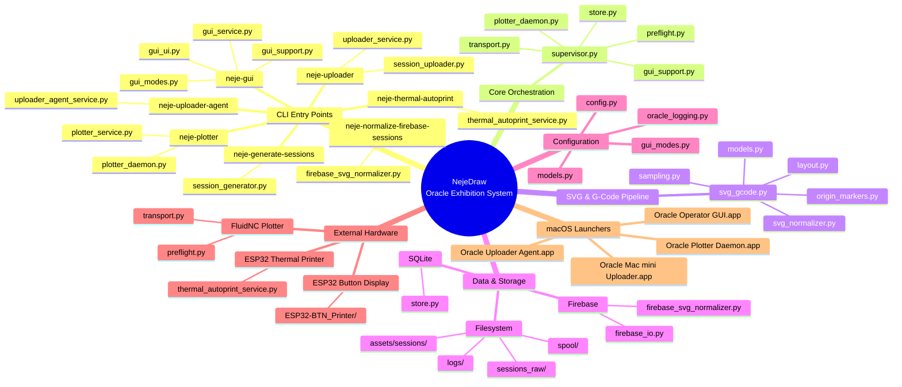
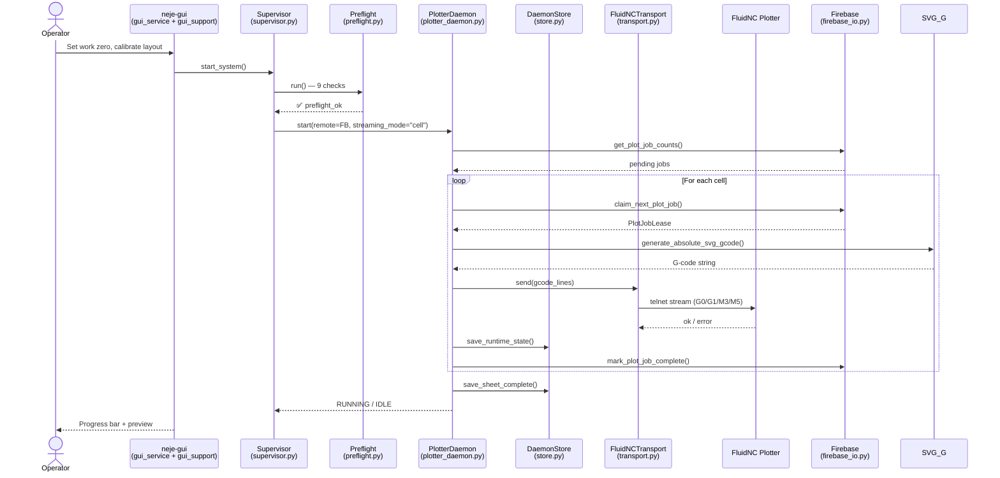
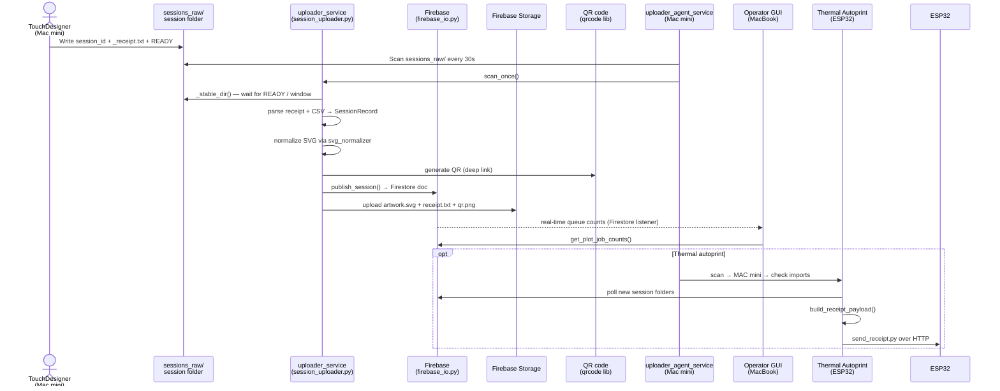
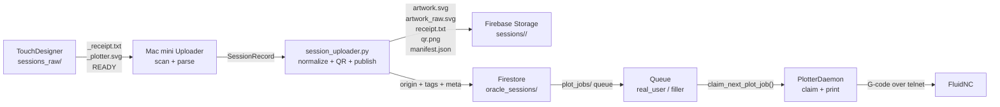

# NejeDraw — Project Map

<!-- Obsidian Canvas Embed: copy the Mermaid block below into an Obsidian Canvas -->

---

## Architecture Mind Map



---

## Module Dependency Graph

```mermaid
graph TD
    %% Entry points
    GUI[neje-gui<br/>gui_service.py]
    PLOTTER[neje-plotter<br/>plotter_service.py]
    UPLOADER[neje-uploader<br/>uploader_service.py]
    AGENT[neje-uploader-agent<br/>uploader_agent_service.py]
    GEN[neje-generate-sessions<br/>session_generator.py]
    NORM[neje-normalize-firebase<br/>firebase_svg_normalizer.py]
    THERM[neje-thermal-autoprint<br/>thermal_autoprint_service.py]

    %% Core orchestration
    SUP[supervisor.py]
    DAEMON[plotter_daemon.py]
    PREFLT[preflight.py]
    TRANS[transport.py]
    STORE[store.py]
    LOG[oracle_logging.py]

    %% SVG / G-code pipeline
    SVG_G[svg_gcode.py]
    SVG_N[svg_normalizer.py]
    LAYOUT[layout.py]
    SAMP[sampling.py]
    ORG[origin_markers.py]

    %% Support
    GUI_SUP[gui_support.py]
    GUI_UI[gui_ui.py]
    MODES[gui_modes.py]
    CONF[config.py]
    MDL[models.py]

    %% External
    FB[firebase_io.py]
    FB_N[firebase_svg_normalizer.py]
    SESSUPL[session_uploader.py]

    %% Entry → orchestration
    GUI --> SUP
    GUI --> GUI_SUP
    GUI --> GUI_UI
    GUI --> MODES
    GUI --> LOG

    PLOTTER --> DAEMON
    PLOTTER --> STORE
    PLOTTER --> TRANS
    PLOTTER --> FB

    AGENT --> SESSUPL
    AGENT --> STORE
    AGENT --> FB

    UPLOADER --> SESSUPL
    UPLOADER --> FB
    UPLOADER --> STORE

    THERM --> SESSUPL
    THERM --> STORE

    %% Core deps
    SUP --> PREFLT
    SUP --> DAEMON
    SUP --> TRANS
    SUP --> STORE
    SUP --> GUI_SUP
    SUP --> SVG_G
    SUP --> MODES
    SUP --> FB
    SUP --> LOG
    SUP --> CONF

    DAEMON --> SVG_G
    DAEMON --> SVG_N
    DAEMON --> LAYOUT
    DAEMON --> SAMP
    DAEMON --> ORG
    DAEMON --> STORE
    DAEMON --> FB
    DAEMON --> TRANS
    DAEMON --> CONF
    DAEMON --> MDL

    PREFLT --> TRANS
    PREFLT --> GUI_SUP
    PREFLT --> MODES
    PREFLT --> MDL
    PREFLT --> CONF

    %% SVG pipeline
    SVG_G --> SVG_N
    SVG_G --> ORG
    SVG_G --> CONF
    SVG_G --> MDL
    SVG_G --> SAMP

    GUI_SUP --> CONF
    GUI_SUP --> FB
    GUI_SUP --> MODES
    GUI_SUP --> MDL
    GUI_SUP --> ORG
    GUI_SUP --> SVG_G
    GUI_SUP --> SVG_N
    GUI_SUP --> LAYOUT
    GUI_SUP --> SAMP
    GUI_SUP --> STORE
    GUI_SUP --> SESSUPL

    GER_NORM --> SVG_N
    GER_NORM --> FB

    SESSUPL --> FB
    SESSUPL --> MDL
    SESSUPL --> STORE
    SESSUPL --> CONF
    SESSUPL --> SVG_N

    TRANS --> MDL
    TRANS --> CONF

    STORE --> MDL
    STORE --> CONF
    STORE --> ORG

    LAYOUT --> MDL
    ORG --> MDL
    SAMP --> MDL

    %% Config / models
    GUI_UI --> MDL
    MODES --> MDL
    LOG --> CONF

    %% styles
    classDef entry fill:#2563eb,color:#fff,stroke:#1d4ed8
    classDef core fill:#7c3aed,color:#fff,stroke:#6d28d9
    classDef svg fill:#059669,color:#fff,stroke:#047857
    classDef data fill:#d97706,color:#fff,stroke:#b45309
    classDef support fill:#6b7280,color:#fff,stroke:#4b5563
    classDef external fill:#dc2626,color:#fff,stroke:#b91c1c

    class GUI,PLOTTER,UPLOADER,AGENT,GEN,NORM,THERM entry
    class SUP,DAEMON,PREFLT,TRANS,STORE,LOG core
    class SVG_G,SVG_N,LAYOUT,SAMP,ORG svg
    class FB,FB_N,SESSUPL data
    class GUI_SUP,GUI_UI,MODES,CONF,MDL support
```



---

## Data Flow — Live Print



---

## Data Flow — Uploader Pipeline (Mac mini)



---

## Session Package Contract



---

## File System Layout

```
NejeDraw/
├── src/neje_oracle/          ← Main package (26 files, 9,423 LOC)
│   ├── config.py             ← All settings dataclasses
│   ├── models.py             ← 22 typed dataclasses
│   ├── supervisor.py         ← Orchestrator (startup / stop / component health)
│   ├── plotter_daemon.py     ← Sheet-level print loop (row/cell streaming)
│   ├── plotter_service.py    ← FastAPI server wrapping PlotterDaemon
│   ├── gui_service.py        ← NiceGUI web UI (8 tab panels)
│   ├── gui_support.py        ← GUI state, preview builders, sheet gen
│   ├── gui_ui.py             ← NiceGUI primitives (buttons, sliders)
│   ├── gui_modes.py          ← Mode → control-policy map
│   ├── preflight.py          ← 9 preflight checks before print
│   ├── transport.py          ← telnet + HTTP FluidNC transport
│   ├── svg_gcode.py          ← SVG → G-code core (polylines, Douglas-Peucker)
│   ├── svg_normalizer.py     ← stroke-normalize / bbox / scale per symbol
│   ├── layout.py             ← Hex + grid packing + organic modifier
│   ├── sampling.py           ← compute_effective_sample_step()
│   ├── origin_markers.py     ← 8 origin types + marker positions
│   ├── store.py              ← SQLite runtime stores (plotter / uploader / oracle)
│   ├── oracle_logging.py     ← TSV log writer + reader
│   ├── session_generator.py  ← Fake session + filler package generator
│   ├── session_uploader.py   ← Session scan + parse + normalize + publish
│   ├── uploader_service.py   ← CLI entry: neje-uploader (thin wrapper)
│   ├── uploader_agent_service.py ← Agent API: neje-uploader-agent (FastAPI)
│   ├── firebase_io.py        ← Firebase Firestore + Storage client
│   ├── firebase_svg_normalizer.py ← Bulk normalize Firebase sessions
│   └── thermal_autoprint_service.py ← Watch + print to ESP32 thermal
│
├── tests/                    ← 13 test files, 163 tests
├── assets/
│   ├── sessions/             ← Published session folders (gitignored)
│   ├── symbols/              ← Base SVG symbols + scale_config.json
│   └── generated_idle_symbols/  ← Auto-generated filler SVG
├── spool/                    ← G-code spool + cache + uploaded_svg
├── sessions_raw/             ← TouchDesigner raw output (Mac mini)
├── logs/                     ← Runtime TSV logs
├── runtime/                  ← Per-session runtime state
├── ESP32-BTN_Printer/        ← ESP32 Arduino/PlatformIO firmware
├── public_gallery/           ← Flutter Web read-only gallery
├── macos_launchers/          ← .app bundles (AutoPKG / deployable)
├── docs/                     ← Documentation + assets
├── archive/                  ← Conversation archives
├── pyproject.toml            ← Project metadata, 8 runtime deps
├── .env.example              ← Env-var template
└── .hermes/                  ← Hermes Agent auto-generated
    ├── plans/                ← Implementation plans
    ├── maps/                 ← (this file lives here)
    └── notes/                ← Session notes
```

---

## Origin Taxonomy

```
origin_type (8 values from origin_markers.py)

REAL    ─ ORIGIN_REAL_MACMINI   ─ real human visitor session (Mac mini TouchDesigner)
FAKE    ─ ORIGIN_FAKE_MACMINI   ─ synthetic test session (same pipeline, but filler flag)
FILLER  ─ ORIGIN_FILLER_MACBOOK  ─ macbook-generated idle / filler material (local only)
USER    ─ ORIGIN_USER_UPLOAD     ─ operator manually uploaded SVG to print
IDLE    ─ ORIGIN_IDLE_LOCAL      ─ auto-generated idle bank symbols
TEST    ─ ORIGIN_TEST            ─ GUI test-print / dry-run
TOUCH   ─ ORIGIN_TOUCHDESIGNER   ─ TouchDesigner direct (non-session)
MAC     ─ ORIGIN_MACBOOK_OPERATOR ─ operator-created on the MacBook

Marker positions: left | right | top | bottom  (per origin)
Colors:       amber #b8860b  |  slate #8f8980  |  slate-dim  |  ink #1f1a17
```

---

## Physical Device Map

```
┌────────────────────────────────────────────────────────────────┐
│  MacBook Operator (this machine)                                │
│                                                                 │
│  neje-gui (NiceGUI → http://127.0.0.1:8787)                    │
│  ├── Controls: layout, scale, mode, preflight                   │
│  ├── Supervisor: starts/stops daemon, tracks component state    │
│  └── Preview: live SVG cell-by-cell                            │
│                                                                 │
│  PlotterDaemon (background process / .app)                      │
│  └── Transport → telnet → FluidNC                              │
│                                                                 │
│  Store (SQLite runtime_db + plotter_db + uploader_db)           │
└──────────────────────────────┬─────────────────────────────────┘
                               │ telnet / HTTP
                               ▼
┌────────────────────────────────────────────────────────────────┐
│  FluidNC Controller (plotter hardware)                          │
│  ┌───────┐  ┌───────┐  ┌───────┐                              │
│  │ WebUI │  │Telnet │  │  G-code ──► Plotter motors            │
│  └───────┘  └───────┘  └───────┘                              │
└────────────────────────────────────────────────────────────────┘

┌────────────────────────────────────────────────────────────────┐
│  Mac mini (TouchDesigner station)                               │
│                                                                 │
│  TouchDesigner ──► sessions_raw/<session_id>/                   │
│                      ├── <id>_receipt.txt                       │
│                      ├── <id>_plotter.svg                       │
│                      └── READY                                  │
│                                                                 │
│  Uploader Agent (neje-uploader-agent / .app)                    │
│  └── scan sessions_raw → publish to Firebase                    │
│                                                                 │
│  Thermal Autoprint ──► ESP32 thermal printer                    │
│              (http://10.28.8.56 — hard-coded, see ⚠️ in audit) │
└──────────────────────────────┬─────────────────────────────────┘
                               │ HTTPS
                               ▼
┌────────────────────────────────────────────────────────────────┐
│  Firebase                                                       │
│  ┌──────────────────┐  ┌──────────────────────┐               │
│  │ Firestore        │  │ Firebase Storage      │               │
│  │ oracle_sessions/ │  │ sessions/<id>/        │               │
│  │ plot_jobs/       │  │   artwork.svg         │               │
│  │ uploader_state/  │  │   qr.png              │               │
│  └──────────────────┘  │   receipt.txt         │               │
│                        │   manifest.json       │               │
│                        └──────────────────────┘               │
└────────────────────────────────────────────────────────────────┘
                               │ HTTPS read
                               ▼
┌────────────────────────────────────────────────────────────────┐
│  Flutter Web Gallery (public)                                   │
│  https://berlogabob.github.io/OracleGallery/                    │
│  Read-only against Firestore                                    │
└────────────────────────────────────────────────────────────────┘
```

---

## CLI / Entry-Point Summary

| Command | Module | Role |
|---------|--------|------|
| `neje-gui` | `gui_service:main` | NiceGUI web UI (operator console) |
| `neje-plotter` | `plotter_service:main` | FastAPI daemon (headless print loop) |
| `neje-uploader` | `uploader_service:main` | One-shot session upload (Mac mini) |
| `neje-uploader-agent` | `uploader_agent_service:main` | FastAPI agent for long-running upload |
| `neje-generate-sessions` | `session_generator:main` | Generate fake user / filler sessions |
| `neje-normalize-firebase-sessions` | `firebase_svg_normalizer:main` | Bulk SVG normalize in-place |
| `neje-thermal-autoprint` | `thermal_autoprint_service:main` | Print receipts to ESP32 thermal |

---

## Module → Responsibility Map

| Module | LOC | Responsibility | Depends on |
|--------|-----|----------------|------------|
| `supervisor.py` | 830 | Orchestrator; start/stop; component health | `plotter_daemon`, `preflight`, `store`, `transport`, `gui_support`, `fb` |
| `plotter_daemon.py` | 978 | Print loop; two streaming modes; manifest + state | `svg_gcode`, `layout`, `store`, `firebase_io`, `transport` |
| `gui_service.py` | 1,108 | NiceGUI 8-tab operator console | `supervisor`, `gui_support`, `gui_ui`, `gui_modes` |
| `gui_support.py` | 1,262 | GUI state; sheet gen; preview builder | config, models, svg_gcode, layout, store, fb_io |
| `models.py` | 586 | All typed dataclasses (22 types) | stdlib only |
| `config.py` | 161 | All settings dataclasses + env-loading | stdlib + pydantic |
| `svg_gcode.py` | 488 | SVG → G-code; polylines; Douglas-Peucker | `svg_normalizer`, `origin_markers`, `config` |
| `svg_normalizer.py` | 356 | Stroke normalization; bbox; scale; jitter | stdlib + `svgpathtools` |
| `layout.py` | 287 | Hex/grid packing; organic modifier | `models` |
| `transport.py` | 413 | telnet + HTTP FluidNC `send()` / `probe()` | `models`, `config` |
| `store.py` | 440 | Three SQLite stores (plotter/oracle/uploader) | `models`, `origin_markers` |
| `preflight.py` | 210 | 9 checks before print is allowed | `transport`, `models`, `config` |
| `session_generator.py` | 429 | Fake session + filler package generation | `origin_markers`, `svg_normalizer`, `config` |
| `firebase_io.py` | 482 | Firebase Firestore + Storage client | `config`, `models`, `origin_markers` |
| `session_uploader.py` | 323 | Scan + parse + normalize + QR + publish | `firebase_io`, `svg_normalizer`, `store` |
| `uploader_service.py` | 20 | CLI thin wrapper around `SessionUploader` | `session_uploader` |
| `uploader_agent_service.py` | 146 | FastAPI agent (health / status / control) | `config`, `firebase_io`, `session_uploader`, `store` |
| `thermal_autoprint_service.py` | 347 | Watch + print receipts to ESP32 | `session_uploader`, `store` |
| `plotter_service.py` | 98 | FastAPI server wrapping `PlotterDaemon` | `config`, `plotter_daemon`, `firebase_io`, `store`, `transport` |
| `gui_ui.py` | 79 | NiceGUI primitives (button / slider / log) | `models` |
| `gui_modes.py` | 62 | Mode → control-policy map | `models` |
| `oracle_logging.py` | 43 | TSV log append + read | `config` |
| `origin_markers.py` | 162 | 8 origin types; marker positions; classification | `models` |
| `sampling.py` | 16 | `compute_effective_sample_step` | `models` |
| `firebase_svg_normalizer.py` | 95 | Bulk SVG normalize for Firebase | `config`, `firebase_io`, `svg_normalizer` |

---

*Generated: 2025-05-20 | Scope: `src/neje_oracle/` + test + ESP32 scripts*
*Audit baseline: 26 source files · 9,423 LOC · 163 tests passed · 0 Ruff issues · 62 Mypy errors*
