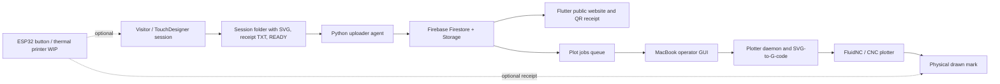

# Oracle / NejeDraw Project Report

Working title: **The Oracle That Wears Us**

This report draft summarizes the project as a connected installation: voice and
session generation in TouchDesigner, a Firebase publication pipeline, a public
Flutter web gallery and receipt website, an operator controller for the plotter,
and a physical plotter/FluidNC drawing system. It also reserves space for the
3D plotter documentation, seven pen assembly iterations, and the ESP32 button /
thermal printer variant.

## Colleague Questions Answered

- **Plotter and emerging technologies:** yes. The plotter is the physical
  endpoint of a networked AI/data/CNC pipeline. It transforms generated session
  data into machine movement and a drawn artifact.
- **Website and interaction design:** yes. The public website defines the
  visitor journey after the installation: QR scan, receipt, mark interpretation,
  and public cloth/archive.
- **Controller website as interaction design:** yes, and it is the stronger
  interaction-design example for operations. It designs how a human operator
  safely controls a live machine through states, gates, feedback, and recovery
  actions.
- **Other mapped areas:** digital fabrication, physical computing, system
  design, backend/cloud publication, exhibition operations, design system,
  narrative design, testing, and deployment.
- **3D/iteration evidence:** placeholders are reserved for plotter 3D models
  and seven drawing pen assembly iterations.
- **Thermal printer option:** the `ESP32-BTN_Printer` branch can be included as
  a WIP alternative/prototype for physical computing and receipt output.

## 1. Project Overview

Oracle is an interactive installation where a visitor's session becomes a
drawn mark. TouchDesigner creates a visitor session folder containing a plotter
SVG, receipt text, and a `READY` marker. The Python uploader publishes the
public assets to Firebase. The Flutter website displays the public receipt,
mark library, and cloth/gallery view. The MacBook operator interface controls
the physical plotter through FluidNC, validates safety gates, generates G-code,
and sends row-based drawing jobs to the machine.

The project is not only a software pipeline. It combines digital fabrication,
interaction design, networked systems, public web design, and physical
computing. The final experience depends on how the visitor, operator, website,
plotter, and physical printed/drawn outputs interact as one system.

## 2. Short System Pipeline

1. Visitor interaction happens in TouchDesigner.
2. TouchDesigner writes a session package:
   `session_id_plotter.svg`, `session_id_receipt.txt`, and `READY`.
3. The uploader normalizes and publishes SVG, receipt text, QR image, and
   manifest data to Firebase.
4. Firebase creates public session data and pending plot jobs.
5. The Flutter web app opens direct QR receipt routes and shows published marks.
6. The operator GUI supervises preflight, calibration, job state, layout, and
   FluidNC connection.
7. The plotter daemon generates row-based G-code, fills empty cells with idle
   symbols, and sends the drawing to the physical plotter.



## 3. Mapping To Subject Areas

| Subject / section area | Project evidence | How to frame it in the report |
| --- | --- | --- |
| Emerging technologies | AI/audio interpretation concept, local generative oracle workflow, Firebase publication, Flutter web app, FluidNC/CNC control, ESP32 peripheral experiments | The plotter is part of a hybrid emerging-tech system where machine learning, web infrastructure, and CNC drawing convert intangible voice data into physical output. |
| Interaction design | Public website, QR receipt flow, cloth/gallery, session lookup, operator controller GUI, TouchDesigner start flow | The public website is interaction design for visitors, while the controller website/GUI is interaction design for the operator. The controller is especially strong as interaction design because it defines real-time decisions, safety gates, feedback, and error recovery. |
| Digital fabrication | Plotter output, SVG-to-G-code conversion, FluidNC motion control, cell layout, rings/origin markers, pen pressure/calibration | The project translates digital marks into controlled machine movement and physical drawing on fabric/paper. |
| Physical computing | ESP32 button, limit switch input, UDP `START` signal to TouchDesigner, BLE thermal printer bridge, FluidNC plotter controller | Sensors, microcontrollers, wireless protocols, and physical output devices connect software events to installation hardware. |
| Web / interface design | Flutter gallery, hash routes, digital receipt, cloth view, marks/about pages, debug sessions page | The website extends the installation after the physical event through QR access and a persistent public archive. |
| System design / backend | Python supervisor, uploader agent, runtime SQLite state, Firebase Firestore/Storage, queue model, preflight checks | The installation needs reliable orchestration across multiple machines, networks, file systems, cloud state, and hardware states. |
| Exhibition operations | Mac mini uploader-only rule, MacBook operator station, test/dry/real modes, ready checks, emergency stop behavior | The work includes operational design: how the system can be safely run by a person during an exhibition. |

## 4. Plotter And Connection To Emerging Technologies

The plotter can be framed as the physical endpoint of an emerging-technology
pipeline. It does not simply print a prepared image. It receives generated
session data, transforms normalized SVG marks into G-code, and draws them as
part of a live installation system. This connects it to emerging technologies
in several ways:

- It materializes data-driven and AI-assisted interpretation. The visitor's
  session becomes a symbolic mark that is drawn by a machine.
- It uses CNC automation in a non-industrial, expressive context. The machine
  is repurposed as a ritual drawing device rather than a standard fabrication
  tool.
- It bridges cloud and local hardware. Firebase stores sessions and plot jobs,
  while the plotter remains locally supervised for safety and reliability.
- It uses real-time machine-state feedback. FluidNC status, Telnet responses,
  controller `Idle` state, alarms, holds, and row acknowledgements all affect
  whether the drawing can continue.
- It turns interface decisions into physical consequences. Calibration,
  layout, scale correction, rings, origin markers, and work-zero setup change
  the final drawn output.

Suggested report sentence:

> The plotter represents emerging technology not because the hardware is new by
> itself, but because it is embedded in a networked, AI-informed, interactive
> system that converts a visitor encounter into a unique physical trace.

## 5. Website And Connection To Interaction Design

The website is part of the interaction design because it shapes how visitors
understand and revisit their session. The QR route on the printed receipt opens
a stable digital receipt page. The site also provides a cloth/gallery view,
mark pages, and project information. Its interaction design role is to connect
the physical installation to a public digital memory.

Important interaction points:

- A visitor can scan a QR code and open `/session/<id>` directly.
- If publishing is still in progress, the receipt page explains that the route
  is valid but the assets are not ready yet.
- The receipt presents the mark, oracle text, measured values, themes, QR image,
  and print status.
- The cloth page shows the public stream of published marks and allows session
  lookup/highlighting.
- The marks/about pages explain the symbolic language and how the installation
  works.

This can be counted as interaction design because the website defines the
visitor's post-installation journey: scan, identify, interpret, revisit, and
locate the mark in a shared public archive.

## 6. Controller Website / Operator GUI As Interaction Design

The controller interface should also be counted as interaction design. It is
not a public website, but it is a real interface designed around a specific
human task: safely operating a live plotter installation.

Why it fits interaction design:

- It creates a workflow from `TEST` to `EXHIBITION DRY` to `EXHIBITION REAL`.
- It uses preflight checks, status panels, logs, and queue counts to reduce
  operator uncertainty.
- It separates dangerous real output from dry-run testing with explicit arming.
- It includes manual controls for FluidNC connection, homing, jogging, unlock,
  resume, and soft reset.
- It includes operational safety states: `Set Work Zero`, `Ready Check`,
  `STOP AFTER SHEET`, and `EMERGENCY STOP`.
- It translates complex machine/network state into decisions an operator can
  make during the exhibition.

Suggested framing:

> The public website is visitor-facing interaction design; the controller GUI is
> operator-facing interaction design. Both are needed because the installation
> has two user groups: visitors who receive and revisit their mark, and
> operators who must safely manage the machine in real time.

## 7. Digital Fabrication And Plotter Development

The fabrication work includes both the software path and the physical drawing
setup:

- SVG normalization to a consistent drawing coordinate system.
- SVG-to-G-code conversion.
- Grid/hex layout planning for sheet capacity.
- Row-based plotting so new user jobs can enter at row boundaries.
- Idle symbol filling when a sheet has empty cells.
- Print-time rings and origin markers.
- Symbol scale correction for physical drawing accuracy.
- FluidNC machine commands for homing, jogging, work-zero, Z up/down, and
  post-sheet return.
- Dry-run G-code generation for testing before real plotting.

This section should include photos, screenshots, G-code examples, calibration
notes, and physical output tests.

## 8. Placeholder: 3D Models Of Plotter

Asset folder:

```text
reports/assets/plotter-3d-models/
```

Add here:

| Slot | Asset to add | Notes |
| --- | --- | --- |
| 3D model 01 | Full plotter assembly render | Overall machine view. |
| 3D model 02 | Plotter top/side view | Show movement axes and drawing bed. |
| 3D model 03 | Pen carriage detail | Show how the pen mount connects to the plotter. |
| 3D model 04 | Exploded view or annotated model | Optional, useful for fabrication explanation. |

Suggested caption:

> 3D plotter model documentation showing the relationship between the drawing
> bed, machine axes, carriage, and custom pen assembly.

## 9. Placeholder: Seven Pen Assembly Iterations

Asset folder:

```text
reports/assets/pen-assembly-iterations/
```

Add one image/model set for each iteration:

| Iteration | Asset placeholder | What to document |
| --- | --- | --- |
| 01 | `pen_iteration_01.*` | First mounting concept and why it failed or changed. |
| 02 | `pen_iteration_02.*` | Adjustment to grip, pressure, or alignment. |
| 03 | `pen_iteration_03.*` | Change in material, tolerance, or printability. |
| 04 | `pen_iteration_04.*` | Change in Z/contact behavior or pen angle. |
| 05 | `pen_iteration_05.*` | Stability improvement during plotting. |
| 06 | `pen_iteration_06.*` | Calibration or maintenance improvement. |
| 07 | `pen_iteration_07.*` | Final or current best assembly. |

For each iteration, include:

- Photo or render.
- What problem it was solving.
- What changed from the previous version.
- Result of physical test.
- Whether it was rejected, partially reused, or accepted.

Suggested caption:

> Seven iterations of the drawing pen assembly show the design process from
> initial mounting experiments to a more stable plotting mechanism.

## 10. ESP32 Button And Thermal Printer Variant

This section can be added as an optional WIP alternative based on the
`ESP32-BTN_Printer` project. It is useful if the report needs to show another
physical computing branch of the installation.

Current WIP idea:

- ESP32 reads a limit switch or button.
- On press, it sends `START` to TouchDesigner over UDP.
- It can expose HTTP endpoints such as `/status`, `/start`, `/wake`,
  `/test-print`, `/probe-print`, and `/print`.
- It can attempt BLE communication with a WP9509 thermal printer.
- Receipt JSON can be sent to the ESP32 and printed as text, QR, and optional
  rasterized symbol data.

How to frame it:

> The ESP32-as-button and thermal printer path is an alternative physical
> interaction module. It experiments with replacing or extending screen-based
> interaction through a physical button and immediate receipt output. Because
> the printer connection is still WIP, it should be presented as a prototype
> branch rather than the main finished system.

Report status:

| Component | Status | Notes |
| --- | --- | --- |
| ESP32 button input | Working/prototype | Limit switch on GPIO 27, sends `START`. |
| TouchDesigner UDP start | Prototype path | UDP on port 7000 or USB serial fallback. |
| Thermal printer bridge | WIP | BLE characteristic accepts bytes, but printer behavior may require protocol probing. |
| Receipt payload tooling | Prototype | Python helper can generate/send receipt payloads. |

## 11. Additional Areas Worked On

These can be used to fill other report sections depending on the required
course structure:

- **Narrative and concept design:** Oracle language, mark names, receipt text,
  and symbolic structure.
- **Design system:** visual identity for the public gallery, receipt styling,
  colors, typography, and mark presentation.
- **Cloud/database work:** Firestore session documents, Storage assets, QR
  links, rules, indexes, and CORS setup.
- **Testing and reliability:** Python tests for layout, SVG/G-code generation,
  preflight, transport, uploader, queue counts, and GUI support.
- **Deployment:** Flutter static build deployed through GitHub Pages from
  `docs/`.
- **Operations:** runbook, mode separation, Mac mini uploader-only rule,
  MacBook plotter controller, dry-run workflow, emergency stop behavior.
- **Data contract design:** session folder shape, manifest, origin/tags,
  published asset URLs, and QR deep links.

## 12. Evidence To Insert

Add these before final submission:

| Evidence | Where to source it |
| --- | --- |
| Screenshot of public website home page | Flutter app or deployed GitHub Pages |
| Screenshot of digital receipt page | `/session/<session_id>` route |
| Screenshot of cloth/gallery page | `/cloth` route |
| Screenshot of operator controller GUI | `uv run neje-gui`, usually `http://127.0.0.1:8787/` |
| Plotter drawing photo/video | Physical test output |
| G-code or SVG process image | `spool/*.gcode` and `assets/symbols/*.svg` |
| 3D plotter model renders | `reports/assets/plotter-3d-models/` |
| Seven pen assembly iteration images | `reports/assets/pen-assembly-iterations/` |
| ESP32 button/printer photos | `ESP32-BTN_Printer/` hardware tests |

## 13. Suggested Final Report Structure

1. Introduction and concept.
2. System overview diagram.
3. Emerging technologies: AI/data pipeline, Firebase, CNC plotter, ESP32 WIP.
4. Interaction design: public website and operator controller.
5. Digital fabrication: plotter, G-code, pen assembly, physical calibration.
6. Web design and deployment: Flutter gallery, QR receipt, public archive.
7. Physical computing: ESP32 button and thermal printer alternative.
8. Iteration process: 3D models and seven pen assembly versions.
9. Testing, risks, and exhibition operation.
10. Conclusion: how the system turns a visitor encounter into a lasting mark.
